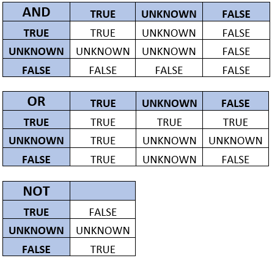

# Behavior of NULLs

SQL uses the `NULL` marker when a value is absent. A nullable column can contain a regular value or `NULL`; however, `NULL` does not itself explain why the value is missing. It might represent information that is unknown, unavailable, not applicable, withheld, or not yet recorded.

Understanding null behavior requires an understanding of SQL's three-valued logic: **TRUE**, **FALSE**, and **UNKNOWN**. It also requires recognizing that different SQL constructs do not all handle nulls identically. Predicates, joins, set operators, grouping, aggregates, constraints, and built-in functions each have specific rules.

The examples in this document use Microsoft SQL Server Transact-SQL.

-----

### Table of Contents

1. [Brief History of NULLs](#1-brief-history-of-nulls)
2. [Predicate Logic](#2-predicate-logic)
3. [ANSI_NULLS](#3-ansi_nulls)
4. [IS NULL and IS NOT NULL](#4-is-null-and-is-not-null)
5. [Sample Data](#5-sample-data)
6. [Join Syntax](#6-join-syntax)
7. [Semi-Joins and Anti-Joins](#7-semi-joins-and-anti-joins)
8. [Set Operators](#8-set-operators)
9. [GROUP BY](#9-group-by)
10. [ORDER BY](#10-order-by)
11. [Aggregate Functions](#11-aggregate-functions)
12. [VALUES](#12-values)
13. [Window Functions](#13-window-functions)
14. [Constraints](#14-constraints)
15. [Computed Columns](#15-computed-columns)
16. [NULLIF, ISNULL, and COALESCE](#16-nullif-isnull-and-coalesce)
17. [Empty Strings, SQL NULL, and ASCII NUL](#17-empty-strings-sql-null-and-ascii-nul)
18. [CONCAT](#18-concat)
19. [Views and Nullability](#19-views-and-nullability)
20. [BIT](#20-bit)
21. [NOT](#21-not)
22. [RETURN](#22-return)
23. [Identity Columns](#23-identity-columns)
24. [LAG and LEAD](#24-lag-and-lead)
25. [Arithmetic Operators](#25-arithmetic-operators)
26. [WHERE](#26-where)
27. [Variables](#27-variables)
28. [Conclusion](#28-conclusion)

-----

## 1. Brief History of NULLs

Missing information has long been debated in relational theory. E. F. Codd proposed marked values to represent different kinds of missing information, while critics such as C. J. Date have argued that nulls complicate relational logic and database design.

SQL ultimately adopted a single `NULL` marker. Because that marker does not preserve the reason a value is absent, applications that must distinguish states such as “unknown” and “not applicable” should model those states explicitly.

For additional relational-theory discussion, see C. J. Date's *Database in Depth: Relational Theory for Practitioners*.

[Back to the table of contents](#table-of-contents)

-----

## 2. Predicate Logic

Under SQL's normal ANSI behavior, ordinary comparisons involving `NULL` evaluate to `UNKNOWN`.

```sql
SELECT 1 WHERE NULL = NULL;  -- UNKNOWN: No Records Returned
SELECT 1 WHERE NULL <> 1;    -- UNKNOWN: No Records Returned
SELECT 1 WHERE NULL > 1;     -- UNKNOWN: No Records Returned
```

A `WHERE`, `ON`, or `HAVING` search condition accepts rows only when its final result is `TRUE`. Both `FALSE` and `UNKNOWN` are rejected.

The basic three-valued rules include the following.



De Morgan's laws continue to hold under three-valued logic.

```sql
-- Both predicates evaluate to UNKNOWN and return no rows.
SELECT 1
WHERE NOT (1 = 2 OR NULL = 1);

SELECT 1
WHERE NOT (1 = 2)
  AND NOT (NULL = 1);
```

The predicates `IS NULL`, `IS NOT NULL`, and `IS [NOT] DISTINCT FROM` are exceptions because they always produce `TRUE` or `FALSE`.

[Back to the table of contents](#table-of-contents)

-----

## 3. ANSI_NULLS

`ANSI_NULLS` controls the historical behavior of `=` and `<>` when an operand is `NULL`. Under ANSI behavior, such comparisons return `UNKNOWN`.

> Starting with SQL Server 2017 (14.x), `ANSI_NULLS` is always `ON`. Code should use `IS NULL`, `IS NOT NULL`, or `IS [NOT] DISTINCT FROM` instead of relying on the obsolete `OFF` behavior.

```sql
SET ANSI_NULLS ON;
GO

SELECT 1 WHERE NULL = NULL;      -- No Records Returned
SELECT 1 WHERE NULL <> NULL;     -- No Records Returned
SELECT 1 WHERE NULL IS NULL;     -- Returns 1
SELECT 1 WHERE NULL IS NOT NULL; -- No Records Returned
```

[Review `SET ANSI_NULLS` in Microsoft Learn.](https://learn.microsoft.com/en-us/sql/t-sql/statements/set-ansi-nulls-transact-sql)

[Back to the table of contents](#table-of-contents)

-----

## 4. IS NULL and IS NOT NULL

Use `IS NULL` and `IS NOT NULL` to test whether an expression is null.

```sql
SELECT 1 WHERE NULL IS NULL;       -- TRUE
SELECT 1 WHERE 1 IS NOT NULL;      -- TRUE
SELECT 1 WHERE 1 IS NULL;          -- FALSE
SELECT 1 WHERE NULL IS NOT NULL;   -- FALSE
```

Do not use `= NULL` or `<> NULL` to perform these tests.

[Back to the table of contents](#table-of-contents)

-----

## 5. Sample Data

The remaining examples use two local temporary tables. Local temporary tables reduce the risk of name collisions with other sessions.

**TableA**
| ID  | Fruit | Quantity |
| --- | ----- | -------- |
| 1   | Apple | 17       |
| 2   | Peach | 20       |
| 3   | Mango | 11       |
| 4   | Mango | 15       |
| 5   | NULL  | 5        |
| 6   | NULL  | 3        |

**TableB**
| ID | Fruit  | Quantity |
| --- | ----- | -------- |
| 1   | Apple | 17       |
| 2   | Peach | 25       |
| 3   | Kiwi  | 20       |
| 4   | NULL  | NULL     |

```sql
DROP TABLE IF EXISTS #TableA;
DROP TABLE IF EXISTS #TableB;
GO

CREATE TABLE #TableA
(
    ID       INT          NOT NULL,
    Fruit    VARCHAR(255) NULL,
    Quantity INT          NULL
);

CREATE TABLE #TableB
(
    ID       INT          NOT NULL,
    Fruit    VARCHAR(255) NULL,
    Quantity INT          NULL
);
GO

INSERT INTO #TableA (ID, Fruit, Quantity)
VALUES (1, 'Apple', 17),
       (2, 'Peach', 20),
       (3, 'Mango', 11),
       (4, 'Mango', 15),
       (5, NULL, 5),
       (6, NULL, 3);

INSERT INTO #TableB (ID, Fruit, Quantity)
VALUES (1, 'Apple', 17),
       (2, 'Peach', 25),
       (3, 'Kiwi', 20),
       (4, NULL, NULL);
GO
```

[Back to the table of contents](#table-of-contents)

-----

## 6. Join Syntax

Null behavior comes from the join predicate, not from the join type itself. A `CROSS JOIN` has no predicate and therefore performs no null comparison.

-----

### INNER JOIN

`NULL = NULL` is `UNKNOWN`, so an ordinary equality join does not match nulls.

```sql
SELECT  a.ID AS A_ID,
        a.Fruit AS A_Fruit,
        b.ID AS B_ID,
        b.Fruit AS B_Fruit
FROM #TableA AS a
INNER JOIN #TableB AS b
    ON a.Fruit = b.Fruit
ORDER BY a.ID, b.ID;
```

Only Apple and Peach match.

| A_ID | A_Fruit | B_ID | B_Fruit |
|------|---------|------|---------|
| 1    | Apple   | 1    | Apple   |
| 2    | Peach   | 2    | Peach   |


If you want NULL values from both tables to match, you can replace them with a common value using `ISNULL`.

```sql
SELECT  a.ID AS A_ID,
        a.Fruit AS A_Fruit,
        b.ID AS B_ID,
        b.Fruit AS B_Fruit
FROM #TableA AS a
INNER JOIN #TableB AS b ON ISNULL(a.Fruit,'') = ISNULL(b.Fruit,'');
```


However, this approach can produce incorrect matches when the replacement value (an empty string in this example) also exists in the table. A safer approach is to explicitly match equal values or two `NULL` values.

```sql
SELECT  a.ID AS A_ID,
        a.Fruit AS A_Fruit,
        b.ID AS B_ID,
        b.Fruit AS B_Fruit
FROM #TableA AS a
INNER JOIN #TableB AS b ON a.Fruit = b.Fruit
                        OR (a.Fruit IS NULL AND b.Fruit IS NULL);
```

| A_ID | A_Fruit | B_ID | B_Fruit |
|------|---------|------|---------|
| 1    | Apple   | 1    | Apple   |
| 2    | Peach   | 2    | Peach   |
| 5    | NULL    | 4    | NULL    |
| 6    | NULL    | 4    | NULL    |

-----

### FULL OUTER JOIN

A full outer join preserves unmatched rows from both inputs, but it still does not match null to null when its predicate uses `=`.

```sql
SELECT  a.ID AS A_ID,
        a.Fruit AS A_Fruit,
        b.ID AS B_ID,
        b.Fruit AS B_Fruit
FROM #TableA AS a
FULL OUTER JOIN #TableB AS b
    ON a.Fruit = b.Fruit;
```

| A_ID | A_Fruit | B_ID | B_Fruit |
|------|---------|------|---------|
| 1    | Apple   | 1    | Apple   |
| 2    | Peach   | 2    | Peach   |
| 3    | Mango   | NULL | NULL    |
| 4    | Mango   | NULL | NULL    |
| 5    | NULL    | NULL | NULL    |
| 6    | NULL    | NULL | NULL    |
| NULL | NULL    | 3    | Kiwi    |
| NULL | NULL    | 4    | NULL    |

-----

### IS [NOT] DISTINCT FROM

SQL Server 2022 and later support `IS NOT DISTINCT FROM`, which treats two nulls as equal for comparison purposes.

```sql
SELECT  a.ID AS A_ID,
        a.Fruit AS A_Fruit,
        b.ID AS B_ID,
        b.Fruit AS B_Fruit
FROM #TableA AS a
INNER JOIN #TableB AS b
    ON a.Fruit IS NOT DISTINCT FROM b.Fruit
ORDER BY a.ID, b.ID;
```

| A_ID | A_Fruit | B_ID | B_Fruit |
|------|---------|------|---------|
| 1    | Apple   | 1    | Apple   |
| 2    | Peach   | 2    | Peach   |
| 5    | NULL    | 4    | NULL    |
| 6    | NULL    | 4    | NULL    |

[Review `IS [NOT] DISTINCT FROM` in Microsoft Learn.](https://learn.microsoft.com/en-us/sql/t-sql/queries/is-distinct-from-transact-sql)

[Back to the table of contents](#table-of-contents)

-----

## 7. Semi-Joins and Anti-Joins

`IN` and `EXISTS` are predicates that SQL Server can often implement as semi-joins. `NOT IN` and `NOT EXISTS` can often be implemented as anti-semi-joins.

-----

### NOT IN

If a `NOT IN` input contains `NULL`, a nonmatching comparison can become `UNKNOWN` and prevent rows from being returned.

```sql
SELECT ID, Fruit
FROM #TableA
WHERE Fruit NOT IN ('Banana', NULL);
```

This returns no rows. For nullable subquery results, `NOT EXISTS` is generally clearer and safer.

| ID | Fruit |
|----|-------|

-----

### IN

A null in an `IN` list does not match a null outer value.

```sql
SELECT ID, Fruit
FROM #TableA
WHERE Fruit IN ('Apple', 'Peach', NULL)
ORDER BY ID;
```

This returns Apple and Peach only.

| ID | Fruit |
|----|-------|
| 1  | Apple |
| 2  | Peach |

-----

### EXISTS

`EXISTS` returns `TRUE` when its subquery returns at least one row. 

This example shows the behavior is different from the `NOT IN` example.

```
SELECT  a.ID, 
        a.Fruit
FROM #TableA AS a
WHERE NOT EXISTS
(
    SELECT 1
    FROM (VALUES ('Banana'), (NULL)) AS v(Fruit)
    WHERE v.Fruit = a.Fruit
)
ORDER BY a.ID;
```

| ID | Fruit |
|----|-------|
| 1  | Apple |
| 2  | Peach |
| 3  | Mango |
| 4  | Mango |
| 5  | NULL  |
| 6  | NULL  |

`[NOT] EXISTS` does not inspect the selected value, and its subquery does not have to be correlated.

The following examples are valid.

```sql
SELECT 1 AS myColumn
WHERE EXISTS (SELECT NULL);

SELECT 1 AS myColumn
WHERE EXISTS (SELECT 1/0);
```

| myColumn |
|----------|
| 1        |

-----

### NOT EXISTS

```sql
SELECT a.ID, a.Fruit
FROM #TableA AS a
WHERE NOT EXISTS
(
    SELECT 1
    FROM #TableB AS b
    WHERE b.Fruit = a.Fruit
      AND b.Quantity = a.Quantity
)
ORDER BY a.ID;
```

The rows where `a.Fruit` is null are returned because the equality predicate finds no matching row; `NULL = NULL` is `UNKNOWN`.

| ID | Fruit |
|----|-------|
| 2  | Peach |
| 3  | Mango |
| 4  | Mango |
| 5  | NULL  |
| 6  | NULL  |

[Back to the table of contents](#table-of-contents)

-----

## 8. Set Operators

For duplicate elimination, set operators treat two nulls as not distinct from one another.

-----

### UNION

```sql
SELECT Fruit FROM #TableA
UNION
SELECT Fruit FROM #TableB
ORDER BY Fruit;
```
| Fruit |
|-------|
| NULL  |
| Apple |
| Kiwi  |
| Mango |
| Peach |

-----

### UNION ALL

`UNION ALL` preserves every row, including every null.

```sql
SELECT Fruit FROM #TableA
UNION ALL
SELECT Fruit FROM #TableB
ORDER BY Fruit;
```

| Fruit |
|-------|
| NULL  |
| NULL  |
| NULL  |
| Apple |
| Apple |
| Kiwi  |
| Mango |
| Mango |
| Peach |
| Peach |

-----

### EXCEPT

```sql
SELECT Fruit FROM #TableB
EXCEPT
SELECT Fruit FROM #TableA;
```

This returns Kiwi. The null from `#TableB` is removed because `#TableA` also contains null.

| Fruit |
|-------|
| Kiwi  |

-----

### INTERSECT

```sql
SELECT Fruit FROM #TableA
INTERSECT
SELECT Fruit FROM #TableB
ORDER BY Fruit;
```

This returns `NULL`, Apple, and Peach.

| Fruit |
|-------|
| NULL  |
| Apple |
| Peach |

[Back to the table of contents](#table-of-contents)

-----

## 9. GROUP BY

`GROUP BY` places all null values for a grouping expression into one group.

```sql
SELECT  Fruit,
        COUNT(*) AS RowCount,
        COUNT(Fruit) AS NonNullFruitCount
FROM #TableA
GROUP BY Fruit
ORDER BY Fruit;
```

| Fruit | RowCount | NonNullFruitCount |
| ----- | -------- | ----------------- |
| NULL  | 2        | 0                 |
| Apple | 1        | 1                 |
| Mango | 2        | 2                 |
| Peach | 1        | 1                 |

[Back to the table of contents](#table-of-contents)

-----

## 10. ORDER BY

In SQL Server, nulls sort before non-null values in ascending order and after non-null values in descending order.

`ORDER BY (SELECT NULL)` supplies a constant ordering expression. It can document that arbitrary ordering is intentional, but it does not guarantee stable or repeatable results.

```sql
SELECT TOP (1) Fruit
FROM #TableA
ORDER BY (SELECT NULL);
```

The output of the above statement can vary, as a true `ORDER BY` is not specified. Use a deterministic key when repeatability matters.

| Fruit |
|-------|
| Apple |

[Back to the table of contents](#table-of-contents)

-----

## 11. Aggregate Functions

Aggregate functions ignore null input values. They do not remove the source rows.  In the following example, 

```sql
SELECT  COUNT(*) AS [RowCount],
        COUNT(Quantity) AS NonNullQuantityCount,
        SUM(Quantity) AS QuantitySum,
        AVG(CAST(Quantity AS DECIMAL(10, 2))) AS QuantityAverage,
        MIN(Quantity) AS QuantityMinimum,
        MAX(Quantity) AS QuantityMaximum
FROM #TableB;
```

| RowCount | NonNullQuantityCount | QuantitySum | QuantityAverage | QuantityMinimum | QuantityMaximum |
|----------|----------------------|-------------|-----------------|-----------------|-----------------|
| 4        | 3                    | 62          | 20.666666       | 17              | 25              |

-----

### COUNT

`COUNT(*)` counts rows. `COUNT(expression)` counts non-null expression results. If an aggregate such as `SUM`, `AVG`, `MIN`, or `MAX` has no non-null inputs, it returns `NULL`.  Note the use of the predicate `1 = 0` which normally would produce an empty set.  In this example a record is returned.

```sql
SELECT  COUNT(*) AS RowCount,
        SUM(Quantity) AS QuantitySum
FROM #TableB
WHERE 1 = 0;
```

Rather than returning an empty result set, the query returns a single row containing 0 and a null marker, respectively.

| RowCount | QuantitySum |
|----------|-------------|
| 0        | NULL        |

-----

## 12. VALUES

An expression consisting entirely of untyped null literals can fail type validation. Cast at least one null to the intended type.

```sql
SELECT SUM(v.MyValue) AS Total
FROM (VALUES (CAST(NULL AS INT)), (NULL)) AS v(MyValue);
```

This returns `NULL` rather than a type error.

| Total |
|-------|
| NULL  |

[Back to the table of contents](#table-of-contents)

-----

## 13. Window Functions

Null grouping behavior also applies to window partitions.

```sql
SELECT  ID,
        Fruit,
        Quantity,
        ROW_NUMBER() OVER (PARTITION BY Fruit ORDER BY ID) AS RowNumber,
        SUM(Quantity) OVER (PARTITION BY Fruit) AS PartitionTotal
FROM #TableA
ORDER BY Fruit, ID;
```

| ID | Fruit | Quantity | RowNumber | PartitionTotal |
|----|-------|----------|-----------|----------------|
| 5  | NULL  | 5        | 1         | 8              |
| 6  | NULL  | 3        | 2         | 8              |
| 1  | Apple | 17       | 1         | 17             |
| 3  | Mango | 11       | 1         | 26             |
| 4  | Mango | 15       | 2         | 26             |
| 2  | Peach | 20       | 1         | 20             |

Use a meaningful `ORDER BY` for ranking functions. Ordering by a constant, including `(SELECT NULL)`, makes row numbering among peers nondeterministic.

```sql
SELECT  
        ROW_NUMBER() OVER (ORDER BY (SELECT NULL)) AS RowNumber,
        Fruit
FROM #TableA
ORDER BY 1;
```

| RowNumber | Fruit |
|-----------|-------|
| 1         | Apple |
| 2         | Peach |
| 3         | Mango |
| 4         | Mango |
| 5         | NULL  |
| 6         | NULL  |

[Back to the table of contents](#table-of-contents)

-----

## 14. Constraints

SQL Server has six different types of table constraints: `DEFAULT`, `CHECK`, `UNIQUE`, `NOT NULL`, `PRIMARY KEY`, and `FOREIGN KEY` definitions.

-----

### NOT NULL

This one is fairly straightforward: a column defined as NOT NULL cannot contain a null marker. If you create the column as nullable, insert a null marker, and then attempt to change the column to NOT NULL, SQL Server rejects the change until all existing null markers are removed or replaced.

```
DROP TABLE IF EXISTS #NotNullConstraint;
GO

-- Create a nullable column
CREATE TABLE #NotNullConstraint
(
ID       INT,
Quantity INT NULL
);

-- Insert a NULL
INSERT INTO #NotNullConstraint (ID, Quantity)
VALUES (1, NULL);
GO

--Msg 515, Level 16, State 2, Line 21
--Cannot insert the value NULL into column 'Quantity', table 'tempdb.dbo.#NotNullConstraint
ALTER TABLE #NotNullConstraint ALTER COLUMN Quantity INT NOT NULL;
```

### PRIMARY KEY

A primary-key column cannot be nullable. A primary key defaults to clustered only when the table does not already have a clustered index or constraint.

-----

### UNIQUE

For a single-column SQL Server unique constraint, only one null is permitted.

```sql
DROP TABLE IF EXISTS #UniqueDemo;

CREATE TABLE #UniqueDemo
(
    ID    INT          NOT NULL,
    Fruit VARCHAR(255) NULL,
    CONSTRAINT UQ_UniqueDemo_Fruit UNIQUE (Fruit)
);

INSERT INTO #UniqueDemo (ID, Fruit)
VALUES (1, NULL);

-- This second null violates the single-column unique constraint.
-- INSERT INTO #UniqueDemo (ID, Fruit) VALUES (2, NULL);
```

-----

### CHECK

A check constraint rejects `FALSE`; it accepts `TRUE` and `UNKNOWN`. Therefore, this constraint permits null.

To prohibit null, declare the column `NOT NULL`. A check constraint such as `CHECK (MyField IS NOT NULL)` can express a similar rule, but nullability metadata and tooling will still differ.

```sql
DROP TABLE IF EXISTS #CheckDemo;

CREATE TABLE #CheckDemo
(
    ID      INT NULL,
    MyField INT NULL,
    CONSTRAINT CK_CheckDemo_Positive CHECK (MyField > 0)
);

INSERT INTO #CheckDemo (ID, MyField)
VALUES (1, NULL); -- accepted because the predicate is unknown

SELECT * FROM #CheckDemo;
```

| ID | MyField |
|----|---------|
| 1  | NULL    |

[Back to the table of contents](#table-of-contents)

-----

### Foreign Key

A nullable foreign-key column can contain multiple nulls. A null foreign key means no relationship is asserted; it is not an orphaned reference. An enforced foreign key prevents non-null values from referencing nonexistent parent rows.

A foreign key can reference a primary key, unique constraint, or qualifying unique index. SQL Server does not enforce foreign keys on temporary tables, so this example uses permanent demonstration tables and removes them afterward.

```sql
DROP TABLE IF EXISTS dbo.NullBehaviorChild;
DROP TABLE IF EXISTS dbo.NullBehaviorParent;
GO

CREATE TABLE dbo.NullBehaviorParent
(
    ParentID INT NOT NULL
        CONSTRAINT PK_NullBehaviorParent PRIMARY KEY
);

CREATE TABLE dbo.NullBehaviorChild
(
    ChildID INT IDENTITY(1, 1) NOT NULL
        CONSTRAINT PK_NullBehaviorChild PRIMARY KEY,
    ParentID INT NULL,
    CONSTRAINT FK_NullBehaviorChild_Parent
        FOREIGN KEY (ParentID)
        REFERENCES dbo.NullBehaviorParent (ParentID)
);
GO

INSERT INTO dbo.NullBehaviorParent (ParentID)
VALUES (1), (2), (3), (4), (5);

INSERT INTO dbo.NullBehaviorChild (ParentID)
VALUES (1), (2), (NULL), (NULL);

SELECT ChildID, ParentID
FROM dbo.NullBehaviorChild
ORDER BY ChildID;
GO

DROP TABLE dbo.NullBehaviorChild;
DROP TABLE dbo.NullBehaviorParent;
GO
```

| ChildID | ParentID |
| ------- | -------- |
| 1       | 1        |
| 2       | 2        |
| 3       | NULL     |
| 4       | NULL     |

[Back to the table of contents](#table-of-contents)

-----

## 15. Computed Columns

A computed column is normally virtual. SQL Server physically stores it when it is marked `PERSISTED`.

Arithmetic involving null returns null.

```sql
SELECT  ID,
        Fruit,
        Quantity + 2 AS QuantityPlus2
FROM #TableB
ORDER BY ID;
```

| ID  | Fruit | QuantityPlus2 |
| --- | ----- | ------------- |
| 1   | Apple | 19            |
| 2   | Peach | 27            |
| 3   | Kiwi  | 22            |
| 4   | NULL  | NULL          |

-----

### Persisted Computed Columns

`NOT NULL` can be specified on a computed column only when the column is also `PERSISTED`. Foreign-key and check constraints on computed columns also require persistence. Primary-key, unique, and index eligibility additionally depends on determinism, precision, ownership, data type, and required session settings.

```sql
DROP TABLE IF EXISTS dbo.NullBehaviorComputed;
GO

CREATE TABLE dbo.NullBehaviorComputed
(
    Int1 INT NOT NULL,
    Int2 INT NOT NULL,
    Int3 AS (Int1 + Int2) PERSISTED NOT NULL,
    CONSTRAINT PK_NullBehaviorComputed PRIMARY KEY CLUSTERED (Int3)
);
GO

DROP TABLE dbo.NullBehaviorComputed;
GO
```

[Review computed-column rules in Microsoft Learn.](https://learn.microsoft.com/en-us/sql/t-sql/statements/alter-table-computed-column-definition-transact-sql)

[Back to the table of contents](#table-of-contents)

-----

## 16. NULLIF, ISNULL, and COALESCE

These constructs have related but different purposes.


* `NULLIF(a, b)` returns `NULL` when `a = b`; otherwise, it returns `a`.
* `ISNULL(a, b)` accepts two arguments and returns `a` when it is non-null; otherwise, it returns `b`. It is evaluated once and normally uses the first argument’s data type and length, which means the replacement value can be truncated.
* `COALESCE(a, b, ...n)` accepts multiple arguments and returns the first non-null expression. Because SQL Server rewrites it as a `CASE` expression, an input can be evaluated more than once. Its result type is determined by `CASE` data-type precedence and expression-length rules.
* `ISNULL` and `COALESCE` can produce different nullability metadata, which can affect computed columns and keys.

```sql
SELECT  ISNULL(NULL, 'foo') AS IsNullResult,
        COALESCE(NULL, NULL, 'foo') AS CoalesceResult,
        NULLIF('foo', 'foo') AS NullIfResult;
```

| IsNullResult | CoalesceResult | NullIfResult |
|--------------|----------------|--------------|
| foo          | foo            | NULL         |

The following example demonstrates an important difference between `ISNULL` and `COALESCE` when SQL Server determines the data type and length of the result. `ISNULL` adopts the data type and length of its first argument. Because `@ShortValue` is declared as `VARCHAR(3)`, the replacement value 'abcdef' is converted to `VARCHAR(3)` and truncated to 'abc'. In contrast, `COALESCE` determines its result type and length using `CASE` expression rules, allowing it to return the complete value 'abcdef'.

```sql
DECLARE @ShortValue VARCHAR(3) = NULL;

SELECT  ISNULL(@ShortValue, 'abcdef') AS IsNullResult,   -- abc
        COALESCE(@ShortValue, 'abcdef') AS CoalesceResult; -- abcdef
```

| IsNullResult | CoalesceResult |
|--------------|----------------|
| abc          | abcdef         |

[Review the official `COALESCE` comparison.](https://learn.microsoft.com/en-us/sql/t-sql/language-elements/coalesce-transact-sql)

[Back to the table of contents](#table-of-contents)

-----

## 17. Empty Strings, SQL NULL, and ASCII NUL

These are three different concepts.

* SQL `NULL` is a marker for an absent value.
* `''` is a zero-length string containing no characters.
* ASCII NUL is the control character with code zero.

Because an empty string has no leftmost character, `ASCII('')` returns null. `ASCII(NULL)` also returns null because its input is absent. Neither result means that SQL `NULL` has ASCII code zero.

```sql
SELECT  LEN('') AS EmptyStringLength,
        DATALENGTH('') AS EmptyStringBytes,
        ASCII('') AS EmptyStringAscii,
        ASCII(NULL) AS SqlNullAscii,
        ASCII(CHAR(0)) AS AsciiNulCode;
```

| EmptyStringLength | EmptyStringBytes | EmptyStringAscii | SqlNullAscii | AsciiNulCode |
|-------------------|------------------|------------------|--------------|--------------|
| 0                 | 0                | NULL             | NULL         | 0            |

[Back to the table of contents](#table-of-contents)

-----

## 18. CONCAT

`CONCAT` implicitly converts its arguments to strings and converts null arguments to empty strings. If all arguments are null, it returns an empty `VARCHAR(1)` string.

```sql
SELECT 1 AS ID, CONCAT(NULL, NULL, NULL) AS ConcatResult
UNION
SELECT 2 AS ID, CONCAT(NULL, 'Hello World', NULL) AS ConcatResult;

```

| ID | ConcatResult |
|----|--------------|
| 1  |              |
| 2  | Hello World  |


Using the concatenation operator `+` we get much different results.

```sql
SELECT 1 AS ID, NULL + NULL + NULL
UNION 
SELECT 2 AS ID, NULL + 'Hello World' + NULL;
```

| ID | ConcatResult |
|----|--------------|
| 1  | NULL         |
| 2  | NULL         |


[Review `CONCAT` in Microsoft Learn.](https://learn.microsoft.com/en-us/sql/t-sql/functions/concat-transact-sql)

[Back to the table of contents](#table-of-contents)

-----

## 19. Views and Nullability

SQL Server can report an expression in a view as nullable even when its source column is declared `NOT NULL`. This is metadata inference for the expression; it does not mean the base column became nullable.

```sql
DROP VIEW IF EXISTS dbo.vwNullBehaviorSource;
DROP TABLE IF EXISTS dbo.NullBehaviorViewSource;
GO

CREATE TABLE dbo.NullBehaviorViewSource
(
    MyInteger INT          NOT NULL,
    MyVarchar VARCHAR(100) NOT NULL,
    MyDate    DATE         NOT NULL
);
GO

CREATE VIEW dbo.vwNullBehaviorSource
AS
SELECT  MyInteger,
        MyVarchar,
        MyDate,
        CAST(MyInteger AS INT) AS MyInteger_Cast,
        CAST(MyVarchar AS VARCHAR(100)) AS MyVarchar_Cast,
        CAST(MyDate AS DATETIME) AS MyDate_Cast,
        MyInteger * 10 AS MyInteger_Computed
FROM dbo.NullBehaviorViewSource;
GO

SELECT  c.name AS ColumnName,
        ty.name AS DataType,
        c.is_nullable
FROM sys.views AS v
INNER JOIN sys.columns AS c
    ON c.object_id = v.object_id
INNER JOIN sys.types AS ty
    ON ty.user_type_id = c.user_type_id
WHERE v.object_id = OBJECT_ID(N'dbo.vwNullBehaviorSource')
ORDER BY c.column_id;
GO

DROP VIEW dbo.vwNullBehaviorSource;
DROP TABLE dbo.NullBehaviorViewSource;
GO
```

| ColumnName         | DataType | is_nullable |
|--------------------|----------|-------------|
| MyInteger          | int      | 0           |
| MyVarchar          | varchar  | 0           |
| MyDate             | date     | 0           |
| MyInteger_Cast     | int      | 1           |
| MyVarchar_Cast     | varchar  | 1           |
| MyDate_Cast        | datetime | 1           |
| MyInteger_Computed | int      | 1           |

[Back to the table of contents](#table-of-contents)

---

## 20. BIT

SQL Server's `BIT` type stores `0` or `1`. A `BIT` column can also store null when the column is declared nullable. SQL Server converts nonzero numeric values to `1`.

```sql
SELECT  CAST(NULL AS BIT) AS NullableBit,
        CAST(0 AS BIT) AS ZeroBit,
        CAST(3 AS BIT) AS NonzeroBit;
```

| NullableBit | ZeroBit | NonzeroBit |
|-------------|---------|------------|
| NULL        | 0       | 1          |

-----

## 21. NOT

`NOT` negates a predicate. Under three-valued logic, `NOT UNKNOWN` remains `UNKNOWN`.

```sql
SELECT ID, Fruit, Quantity
FROM #TableA
WHERE NOT (Fruit = 'Mango')
ORDER BY ID;
```

Rows where `Fruit` is null are not returned because the predicate remains `UNKNOWN`, and `WHERE` keeps only `TRUE`.

| ID | Fruit | Quantity |
|----|-------|----------|
| 1  | Apple | 17       |
| 2  | Peach | 20       |

[Back to the table of contents](#table-of-contents)

---

## 22. RETURN

`RETURN` exits a batch or stored procedure and can provide an integer status. By convention, zero indicates success and nonzero values indicate other statuses, but application code can define its own nonzero meanings.

A stored procedure cannot return a null status. SQL Server emits a warning and substitutes zero.

```sql
DROP PROCEDURE IF EXISTS dbo.NullBehaviorReturnDemo;
GO

CREATE PROCEDURE dbo.NullBehaviorReturnDemo
AS
BEGIN
    RETURN NULL;
END;
GO

DECLARE @ReturnStatus INT;

EXECUTE @ReturnStatus = dbo.NullBehaviorReturnDemo;
SELECT @ReturnStatus AS ReturnStatus;
GO

DROP PROCEDURE dbo.NullBehaviorReturnDemo;
GO
```

| ReturnStatus |
|--------------|
| 0            |

[Back to the table of contents](#table-of-contents)

---

## 23. Identity Columns

To generate the next identity value, omit the identity column from the insert. Explicitly supplying `NULL` is still an attempt to provide an identity value and fails when `IDENTITY_INSERT` is off.

```sql
DROP TABLE IF EXISTS #IdentityDemo;

CREATE TABLE #IdentityDemo
(
    ID INT IDENTITY(1, 2) NOT NULL
);

INSERT INTO #IdentityDemo DEFAULT VALUES;
INSERT INTO #IdentityDemo DEFAULT VALUES;

SELECT ID
FROM #IdentityDemo
ORDER BY ID; -- 1, 3

BEGIN TRY
    INSERT INTO #IdentityDemo (ID)
    VALUES (NULL);
END TRY
BEGIN CATCH
    SELECT  ERROR_NUMBER() AS ErrorNumber,
            ERROR_MESSAGE() AS ErrorMessage;
END CATCH;
```

Using `TRY...CATCH` displays the actual error for the SQL Server version and session configuration running the example.

> Msg 339, Level 16, State 1, Line 16
> DEFAULT or NULL are not allowed as explicit identity values.

[Back to the table of contents](#table-of-contents)

---

## 24. LAG and LEAD

SQL Server 2022 and later support `IGNORE NULLS` and `RESPECT NULLS` with `LAG` and `LEAD`.

* `IGNORE NULLS` skips null values while locating the preceding or following value.
* `RESPECT NULLS` includes null values and is the default.

Microsoft fixed an `IGNORE NULLS` incorrect-results issue in **SQL Server 2022 CU4**. Install CU4 or a later cumulative update before relying on this feature.

```sql
WITH LagLeadValues AS
(
    SELECT ID, MyValue
    FROM (VALUES (1, 100),(2, 200),(3, NULL),(4, 300)) AS v(ID, MyValue)
)
SELECT  ID,
        MyValue,
        LAG(MyValue, 1, 0) IGNORE NULLS OVER (ORDER BY ID) AS LagIgnoreNulls,
        LEAD(MyValue, 1, 0) IGNORE NULLS OVER (ORDER BY ID) AS LeadIgnoreNulls,
        LAG(MyValue, 1, 0) RESPECT NULLS OVER (ORDER BY ID) AS LagRespectNulls,
        LEAD(MyValue, 1, 0) RESPECT NULLS OVER (ORDER BY ID) AS LeadRespectNulls
FROM LagLeadValues
ORDER BY ID;
```

| ID | MyValue | LagIgnoreNulls | LeadIgnoreNulls | LagRespectNulls | LeadRespectNulls |
| -- | ------- | -------------- | --------------- | --------------- | ---------------- |
| 1  | 100     | 0              | 200             | 0               | 200              |
| 2  | 200     | 100            | 300             | 100             | NULL             |
| 3  | NULL    | 200            | 300             | 200             | 300              |
| 4  | 300     | 200            | 0               | NULL            | 0                |

[Review `LEAD` and the CU4 note in Microsoft Learn.](https://learn.microsoft.com/en-us/sql/t-sql/functions/lead-transact-sql)

[Back to the table of contents](#table-of-contents)

-----

## 25. Arithmetic Operators

Arithmetic involving a null operand normally returns null.

```sql
DECLARE @NullInteger INT = NULL;

SELECT  1 / @NullInteger AS DivideByNull,
        @NullInteger / 1 AS NullDividedByOne,
        1 * @NullInteger AS MultiplyByNull,
        1 - @NullInteger AS SubtractNull,
        1 + @NullInteger AS AddNull;
```

All five results are `NULL`.

| DivideByNull | NullDividedByOne | MultiplyByNull | SubtractNull | AddNull |
|--------------|------------------|----------------|--------------|---------|
| NULL         | NULL             | NULL           | NULL         | NULL    |

[Back to the table of contents](#table-of-contents)

-----

## 26. WHERE

An ordinary inequality comparison with null evaluates to `UNKNOWN`, so nullable rows are not returned.

```sql
SELECT ID, Fruit, Quantity
FROM #TableA
WHERE Fruit <> 'Mango'
ORDER BY ID;
```

| ID | Fruit | Quantity |
|----|-------|----------|
| 1  | Apple | 17       |
| 2  | Peach | 20       |

-----

The following SQL statement include null markers explicitly using the `IS NULL` operator.

```sql
SELECT ID, Fruit, Quantity
FROM #TableA
WHERE Fruit <> 'Mango'
   OR Fruit IS NULL
ORDER BY ID;
```

| ID | Fruit | Quantity |
|----|-------|----------|
| 1  | Apple | 17       |
| 2  | Peach | 20       |
| 5  | NULL  | 5        |
| 6  | NULL  | 3        |

-----

### IS DISTINCT FROM

On SQL Server 2022 and later, this null-aware alternative also includes nulls.

```sql
SELECT ID, Fruit, Quantity
FROM #TableA
WHERE Fruit IS DISTINCT FROM 'Mango'
ORDER BY ID;
```

| ID | Fruit | Quantity |
|----|-------|----------|
| 1  | Apple | 17       |
| 2  | Peach | 20       |
| 5  | NULL  | 5        |
| 6  | NULL  | 3        |


[Back to the table of contents](#table-of-contents)

-----

## 27. Variables

When a `SELECT` assignment processes no rows, SQL Server leaves the variable unchanged.

```sql
DECLARE @Test VARCHAR(100) = 'Default';

SELECT @Test = 'My New Value'
WHERE 1 = 0;

SELECT @Test AS MyValue; -- Default
```

| MyValue |
|---------|
| Default |

-----

### Variables and Scalar Subquery

By contrast, assigning the result of a scalar subquery with `SET` produces null when the subquery returns no rows.

Also use care when a `SELECT` assignment can process multiple rows; the final assigned value can depend on plan and processing order unless the query guarantees one row.

```sql
DECLARE @Test VARCHAR(100) = 'Default';

SET @Test =
(
    SELECT 'My New Value'
    WHERE 1 = 0
);

SELECT @Test AS MyValue; -- NULL
```

| MyValue |
|---------|
| NULL    |

[Back to the table of contents](#table-of-contents)

-----

## 28. Conclusion

The central rule is that ordinary comparisons involving null generally produce `UNKNOWN`, and search conditions retain only `TRUE`. From that rule follow many behaviors in joins, filters, checks, and anti-joins.

Other constructs deliberately use different semantics.

* `IS NULL` and `IS NOT NULL` test for null directly.
* `IS [NOT] DISTINCT FROM` provides two-valued, null-aware comparison.
* Set operators and `GROUP BY` treat nulls as not distinct for duplicate elimination and grouping.
* Most aggregates ignore null inputs, while `COUNT(*)` counts rows.
* Constraints, metadata inference, and built-in functions each apply their documented null rules.

Always include nulls, empty strings, duplicate values, and empty input sets in database tests. Also test under the exact SQL Server version and cumulative update used in production.

[Back to the table of contents](#table-of-contents)
